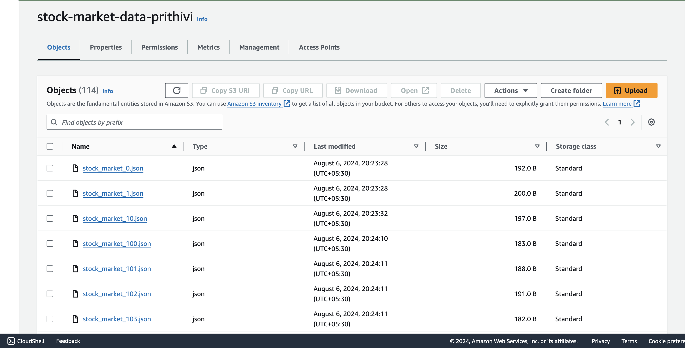
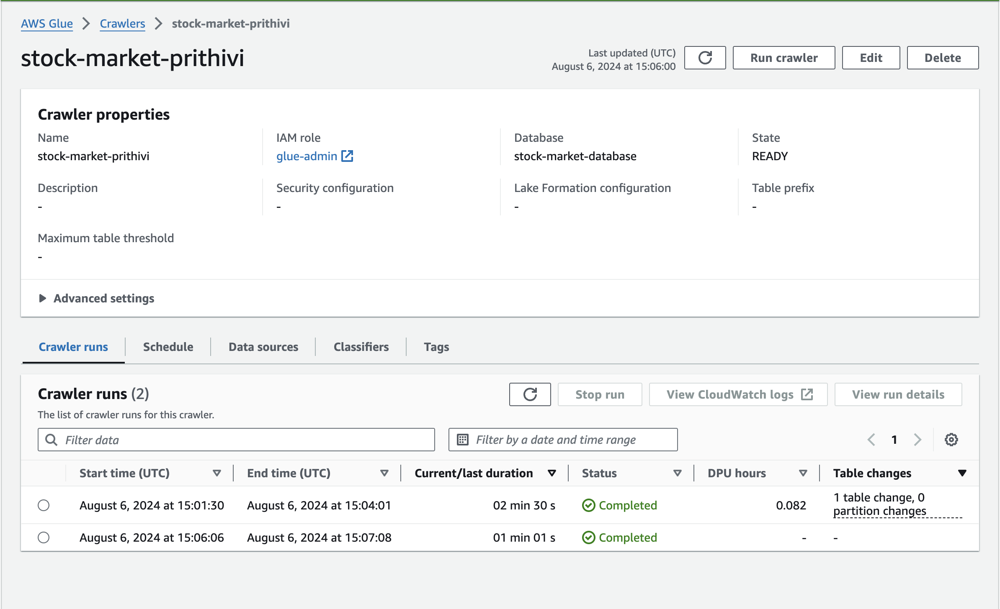
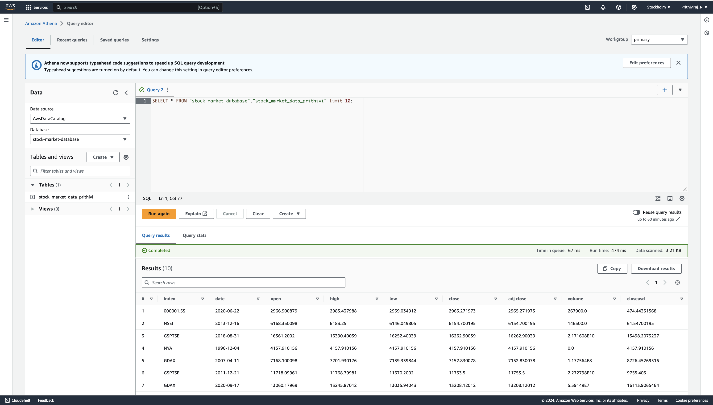

# STOCK MARKET DATAPIPLINE 

This is a end-to-end data engineering project on stock market data.

## Architecture 

## Tech-Stack
   - Programming Language - Python
   - Amazon Web Service (AWS)
    1. S3 (Simple Storage Service)
    2. Athena
    3. Glue Crawler
    4. Glue Catalog
    5. EC2
    - Apache Kafka

## methodology

Here for the data i have used a csv file.
now from this csv file using kafka i am using a producer program to produce the data in the json format and the consumer program will dump this data in __AWS S3 BUCKET__

now this data in the S3 bucket will used by the __AWS CRAWLER__ which automatically identifies and catalogs data 

now this data can be used in the  __AWS ATHENA__ to query and perform simple analytics.

This is the simple pipeline where real time data can be used to be stored in a data base and be used for querying.

The complete computation is done on __AWS EC2__.

reffer to video below to see how the producer and consumer works and data flows.
<iframe width="560" height="315" src="producer_consumer.mov" frameborder="0" allowfullscreen></iframe>

